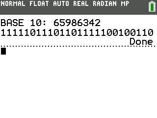

# decimal-to-binary-ti-basic

A TI-Basic program that can convert decimal numbers to binary numbers

---

## Build Instructions

There are multiple ways to build TI-Basic programs, and here are two.

### Build with TI Connect CE Software

**This method does not work with *TI Connect CE for Chrome OS***

1. Create a new program in [TI Connect CE](https://education.ti.com/en/products/computer-software/ti-connect-ce-sw).
2. Copy and paste the text from [`DECTOBIN.txt`](DECTOBIN.txt) into the program.
3. Save the program (`.8xp` file).

(This may also work with [TI Connect](https://education.ti.com/en/products/computer-software/ti-connect-sw), but it have not been tested with this.)

### Build on a calculator

1. Create a new program on the calculator.
2. Manually enter in the code from [`DECTOBIN.txt`](DECTOBIN.txt) into the program.
3. Export the program (`.8xp` file) from the calculator (tested with [TI Connect CE](https://education.ti.com/en/products/computer-software/ti-connect-ce-sw), but will likely also work with [TI Connect](https://education.ti.com/en/products/computer-software/ti-connect-sw) as well).
